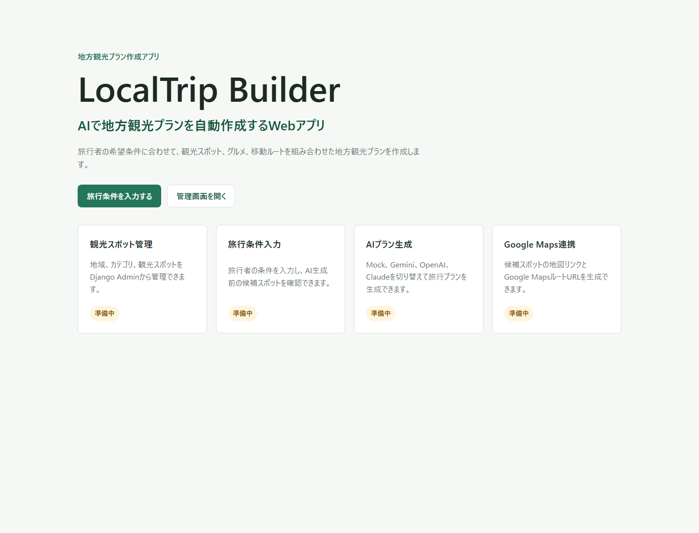
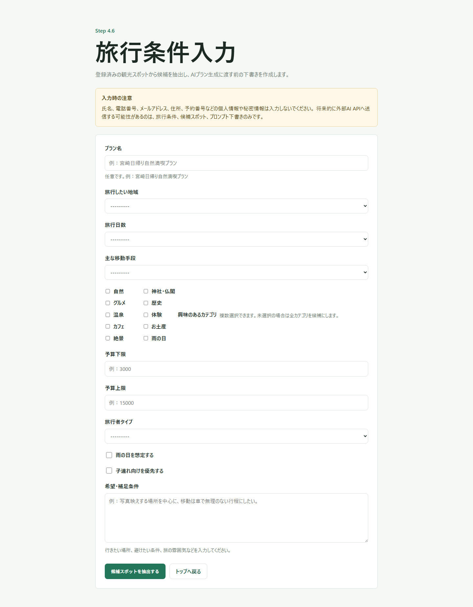
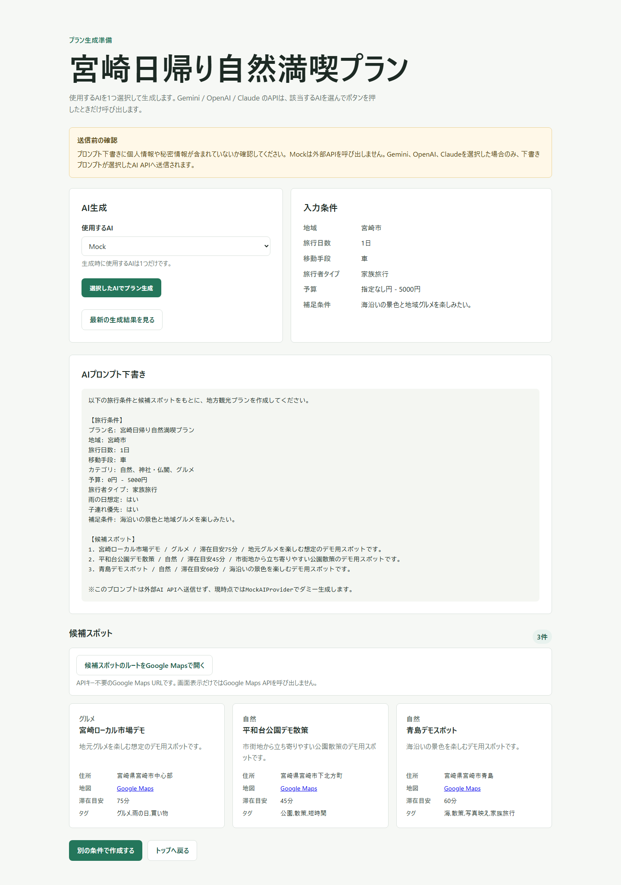
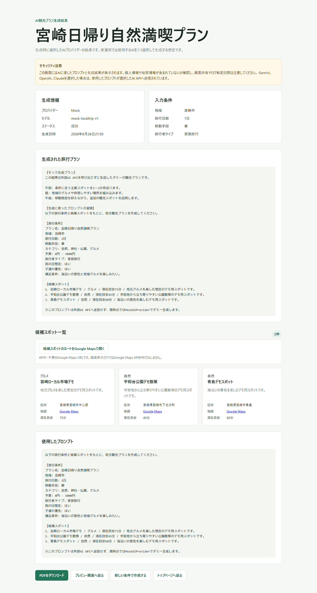
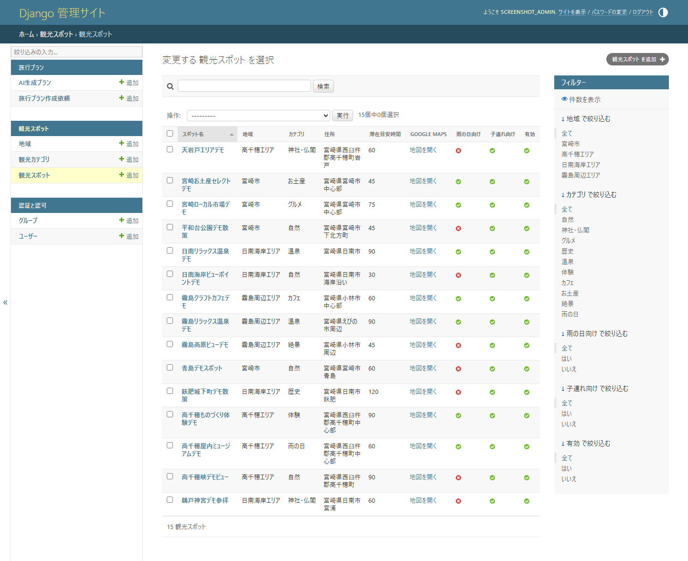

# LocalTrip Builder

LocalTrip Builder は、地方観光向けの旅行プラン作成アプリです。旅行者の希望条件に合わせて登録済みの観光スポットから候補を抽出し、生成AIを使って観光ルート案を作成します。

観光スポット管理、旅行条件入力、候補スポット確認、AIプロバイダー切り替え、Google MapsルートURL生成、PDF出力までをDjangoで一通り確認できる構成です。

## 解決する課題

- 地域の観光スポット情報を管理しながら、旅行者ごとの条件に合う候補を素早く絞り込みたい
- 観光案内やモデルコース作成の下書きを、生成AIで効率化したい
- Google MapsリンクやPDF出力を含め、提案資料として共有しやすい形にしたい
- Gemini / OpenAI / Claude など複数AIプロバイダーを差し替えやすい設計で検証したい

## 主な機能

- Django Adminによる観光スポット管理
- 地域、日数、移動手段、カテゴリ、予算、旅行者タイプなどの旅行条件入力
- 条件に合う候補スポット抽出
- 生成AIによる旅行プラン作成
- Mock / Gemini / OpenAI / Claude の複数AIプロバイダー対応
- Google Maps検索URL・ルートURL生成
- AI生成結果のPDF出力
- デモデータ投入コマンド
- 外部APIキー未設定時の安全なエラー処理

## 使用技術

- Python
- Django
- PostgreSQL / SQLite
- Google Maps URL / Geocoding
- Gemini API
- OpenAI API
- Claude API
- ReportLab
- python-dotenv
- Docker Compose

## Screenshots

### Home



### Travel Plan Request



### Spot Preview


### AI Generated Plan


### Google Maps Route



### PDF Output



### Admin Spot Management



## セットアップ

### 1. 仮想環境と依存関係

```bash
python -m venv .venv
.venv\Scripts\activate
pip install -r requirements.txt
```

### 2. 環境変数

`.env.example` をコピーして `.env` を作成します。

```bash
copy .env.example .env
```

`.env.example` にはダミー値のみを記載しています。実際のAPIキー、Djangoの `SECRET_KEY`、DBパスワードは `.env` にだけ設定し、GitHubへ公開しないでください。

主な環境変数:

- `SECRET_KEY`
- `DEBUG`
- `ALLOWED_HOSTS`
- `DATABASE_ENGINE`
- `DATABASE_NAME`
- `DATABASE_USER`
- `DATABASE_PASSWORD`
- `DATABASE_HOST`
- `DATABASE_PORT`
- `SQLITE_DATABASE_NAME`
- `GOOGLE_MAPS_API_KEY`
- `GEMINI_API_KEY`
- `OPENAI_API_KEY`
- `ANTHROPIC_API_KEY`

### 3. データベース

PostgreSQLを使う場合:

```bash
docker compose up -d
python manage.py migrate
```

ローカル確認やスクリーンショット作成でSQLiteを使う場合は、`.env` で以下を指定します。

```env
DATABASE_ENGINE=sqlite
SQLITE_DATABASE_NAME=db.sqlite3
```

その後、マイグレーションを実行します。

```bash
python manage.py migrate
```

`db.sqlite3` や `*.sqlite3` は `.gitignore` で除外しています。

### 4. デモデータ投入

```bash
python manage.py seed_demo_data
```

このコマンドは外部APIを呼び出しません。Google Maps API、Geocoding API、Gemini、OpenAI、Claudeへの通信も行いません。

### 5. 開発サーバー

```bash
python manage.py runserver
```

トップページ:

```text
http://127.0.0.1:8000/
```

管理画面:

```text
http://127.0.0.1:8000/admin/
```

管理画面を確認する場合は、ローカルで管理ユーザーを作成してください。

```bash
python manage.py createsuperuser
```

## AI API連携

AIプロバイダーは共通インターフェースで切り替えられる構成です。

- `Mock`: 外部APIを呼び出さないデモ・テスト用プロバイダー
- `Gemini`: Gemini API
- `OpenAI`: OpenAI API
- `Claude`: Anthropic Claude API

Gemini / OpenAI / Claude は、プレビュー画面で対象プロバイダーを選択し、生成ボタンを押したPOST時だけ呼び出します。APIキーが未設定、または `dummy-` で始まるダミー値の場合は実APIを呼ばず、失敗結果として保存します。通常の画面表示、テスト、デモデータ投入、PDF生成では外部AI APIを呼び出しません。

## Google Maps連携

候補スポットのGoogle MapsリンクとルートURLは、APIキー不要のURL生成として実装しています。画面表示やPDF出力だけではGoogle Maps APIを呼び出しません。

住所から緯度経度を取得するGeocoding連携は管理画面アクションとして用意しています。`GOOGLE_MAPS_API_KEY` が未設定またはダミー値の場合は実行されません。

## PDF出力

AI生成結果画面からPDFをダウンロードできます。PDFには以下を含めます。

- AI生成プラン
- 入力条件
- 候補スポット一覧
- Google Mapsリンク
- Google MapsルートURL
- 注意事項

PDFはサーバー上に保存せず、その場でPDFレスポンスとして返します。PDF生成時にAI APIやGoogle Maps APIは呼び出しません。

## テスト

```bash
python manage.py check
python manage.py makemigrations --check --dry-run
python manage.py test
```

PostgreSQLを起動していない環境では、SQLiteで確認できます。

```bash
DATABASE_ENGINE=sqlite python manage.py test
```

Windows PowerShellの場合:

```powershell
$env:DATABASE_ENGINE="sqlite"; python manage.py test
```

## セキュリティ上の注意

- `.env`、`.env.*`、ローカルDB、ログ、アップロードファイル、生成PDFはGit管理対象にしません。
- `.env.example` には実値ではなくダミー値のみを記載します。
- `DEBUG=True` はローカル開発用です。本番や公開環境では `DEBUG=False` にしてください。
- `DEBUG=False` では `SECRET_KEY` と `ALLOWED_HOSTS` の明示設定が必要です。
- APIキー、DBパスワード、Djangoの `SECRET_KEY` はREADMEやソースコードに直接書かないでください。
- 旅行条件やAIプロンプトに、氏名、電話番号、メールアドレス、住所、予約番号などの個人情報を入力しないでください。
- 管理画面 `/admin/` は管理者のみが利用する前提です。

## 関連ドキュメント

- [デモシナリオ](docs/demo_scenario.md)
- [プロダクト概要](docs/product_overview.md)
- [公開前チェックリスト](docs/publish_checklist.md)

## 今後の改善案

- AIプロンプト品質の改善
- 移動時間や営業時間を考慮した旅程最適化
- Google Mapsルート表示の詳細化
- PDFレイアウトの改善
- Django Adminの入力補助とデータ管理改善
- 本番デプロイ向け設定の整理
